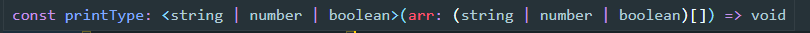

## 레포지토리 개요

해당 레포지토리는 `Typescript` 튜토리얼 레포지토리입니다.

<br>
<br>

## ✅ Typescript 개요

- 오픈소스 프로그래밍 언어
- `Javascript`의 상위 집합으로 ECMA스크립트의 최신 표준을 지원
- 정적인 언어로 컴파일 시간에 타입을 검사
- 장점
    - 강력한 타입으로 대규모 어플리케이션 개발에 용이하다.  
      (여러명이 개발할 때 특정 메서드에서 요구하는 데이터 타입을 통일할 수 있다.)
    - 유명한 Javascript 라이브러리와의 호환으로 편리한 개발이 가능하다.
    - 개발 도구에서의 강력한 지원이 뒷받침된다.

- Typescript Compiler는 Node.Js 기반으로 구동되기 때문에 `Node.Js`를 설치해주어야 한다.

<br>
<br>

## ✅ 개발환경 구축

1. Node.Js 설치

2. 개발 프로젝트 생성

3. `typescript` 설치

global (전역) 설치

```
(sudo) npm install typescript -g
```

4. 컴파일

```
tsc 컴파일대상파일.ts
```

이후 js 파일 생성 확인

<br>
<br>

## ✅ 컴파일 설정: tsconfig.json

- Typescript compilier의 기본 설절을 할 수 있는 파일입니다.
- 명령어를 통한 `tsconfig.json` 파일 설치
```
npx tsc --init
```

- 최상위루트의 `tsconfig.json` 파일을 참고해주세요.
- 기본 설정 속성에 대한 설명만 포함되어 있습니다.  
  자세한 설명은 [공식문서](https://www.typescriptlang.org/ko/docs/handbook/tsconfig-json.html)를 확인해주세요.

- 기본 설정 이후 해당 명령어를 통해 컴파일하기
```
tsc
```

<br>
<br>

## ✅ 변수선언

`Typescript`는 `Javascript`의 상위 집합이므로 `var`, `let`, `const` 키워드를 통해 변수를 선언할 수 있습니다.

```
함수 단위 scope : var
블록 단위 scope:: let, const
```

다만, 일반적인 `Javscript`의 변수 선언 방식과 달리 `Typescript`에서는 다음 방식이 적용됩니다.

1. 변수를 선언하고 값을 할당하였다면, 값의 데이터 타입이 변수의 타입으로 지정됩니다. 
2. 만약 아무런 값을 할당하지 않았다면 (let, var의 경우),  
  - 타입 지정하지 않은 경우: `any` 타입으로 어떠한 값을 할당할 수 있습니다.
  - 타입을 지정한 경우: 지정한 데이터 타입의 값만 할당할 수 있습니다.

자세한 내용은 [블로그](https://velog.io/@sangwoong/JS-TS-variables)를 확인해주세요.

<br>
<br>

## ✅ 기본 타입

`Typescript`는 기본적으로 `Javascript`의 원시형 및 객체 타입을 지원합니다.

``` typescript
let numValue: number; // int, float, decimal
let strValue: string; // "", '', template literal
let booleanValue: boolean; // true or false
let undefinedValue: undefined;
let nullValue: null; 
let objectValue: object;
let symbolValue: symbol;
```

### 📌 `undefined`와 `null`
- 모든 데이터타입의 하위 타입입니다.
그렇기 때문에 `number`, `string`, `boolean` 타입으로 지정된 변수에 `undefined`, `null`을 할당할 수 있습니다.

- 반면, `any`는 모든 데이터타입의 상위 타입입니다.
위에서 설명한 7가지 데이터 타입의 값을 모두 할당할 수 있습니다.

### 📌 `object` 
- 원시형 데이터 타입은 값으로 할당할 수 없으며, `{} 중괄호`로 감싼 데이터를 할당할 수 있습니다.

- `new String()`은 object 타입을 반환하기 때문에 변수에 할당할 수 있습니다.

- `Inline Type` 설정
  ``` Typescript
  let object1: { name: string, age: number };
  object1 = {
    name = "sangwoong",
    age = 27
  }
  ```

### 📌 `array`
- 배열을 데이터 타입으로 선언하는 방법은 다음 방식이 있습니다.
```typescript
let stringArr: string[];
let anyArr: any[];
```
- `stringArr: string:[]`
  - 배열의 각 요소로 문자열 (숫자 지정 시 숫자) 형태의 데이터만 넣을 수 있습니다.
  ``` typescript
  stringArr = ["1", "2", "3"] // 가능
  stringArr.push("String") // 가능
  stringArr = [1, 2, 3] // 불가능 
  ```
- `anyArr: any[]`
  - 각 요소로 모든 타입의 데이터를 넣을 수 있습니다.
  ```typescript
  anyArr = [1, "String", true]
  anyArr.push(5)
  ```

### 📌 `tuple`
  - 배열을 지정하는 방식과 비슷합니다.
  - 하지만 `tuple` 타입은 지정한 원소의 개수만큼의 데이터를 할당할 수 있습니다.
  ``` typescript
  let tupleTwo: [number, string]
  tupleTwo = [27, "sangwoong"]

  let tupleThree: [number, string, string]
  tupleThree = [27, "sangwoong", "Kim"]
  ```

### 📌 `Type Alias (별칭)`

- `Alias`는 특정 타입이나 인터페이스를 참조할 수 있는 타입 변수를 의미합니다.
- 반복되는 타입 설정을 줄일 수 있습니다.
``` typescript
type User = {
  name: string,
  age?: number // optional type
}

const user1: User = {
  name: "sangwoong",
  age: 27
}
```

## ✅ 함수형 타입

`Typescript`에서는 함수의 매개변수에 데이터 타입을 지정할 수 있습니다.

함수 블록 내부에서 반환되는 값으로 함수의 값을 지정할 수 있습니다.

### 📌 함수 선언 예저

아래 예제를 통해 알아보겠습니다.

``` typescript
function add(x: number, y:number):number {
  return x + y
}
const result = add(1, 2)

console.log(result) // 3
console.log(typeof result) // number type, the returned value of funciton "add"
```

함수의 매개변수의 `기본값`을 설정하거나 `optional type`을 지정하는 경우는 다음과 같습니다. 

``` typescript
// 기본
function user(name: string, age: number) {
  return {
    name,
    age
  }
}

// optional type
function user(name?: string, age?: number) {
  return {
    name,
    age
  }
}

// Default value
function user(name="name", age=0) {
  return {
    name,
    age
  }
}

```

<br>

### 📌 화살표 함수

ES6 화살표 함수를 사용할 때도 동일합니다. 

``` typescript
const add = (x: number, y: number):number => x + y
```

<br>

### 📌 Call Signature

함수 매개변수와 반환 값의 데이터 타입을 미리 선언하여 사용할 수도 있습니다.

``` typescript
type Add = (a: number, b: number) => number

const add:Add = (a, b) => a + b;
```

객체 타입이나 일반 원시형 데이터 타입을 반환하는 일반전익 `Type Alias`와의 차이점으로는 매개변수와 함수의 반환 값을 설정하는 것에 있다고 보면 되겠습니다.

<br>

### 📌 Overloading

동일한 이름을 가진 함수에 여러 매개변수를 적용하는 방법을 `Overloading`이라고 합니다.

위 `Call Signature`에서 사용한 예제를 다음과 같이 구현할 수 있습니다. 

``` typescript
type Add = {
  (a: number, b: number) : number
  (a: number, b: number, c: number) :number
}

const add: Add = (a, b, c?: number) => {
  if (c) return a + b + c
  return a + b
}
```

`Call Signature`로 선언한 매개변수와 반환 타입이 여러 개가 있을 경우,  
아래 `optional type`을 선언한 방식과 같이 함수를 작성할 수 있습니다.

<br>
<br>

## ✅ Generic

generic 프로그래밍은 데이터 형식에 의존하지 않고 여러 데이터 타입을 가질 수 있는 프로그래밍을 일컫습니다.

재사용성이 높은 컴포넌트를 만들 때 사용되며, 여러 타입에서 동작하는 컴포넌트를 생성하는데 사용할 수 있습니다.

<br>

### 📌 any 타입을 설정해도 되지 않을까?

`Typescript`에서 선언한 변수의 데이터를 지정하지 않을 경우 그 데이터 타입은 `any` 타입으로 자동 지정됩니다.

또는, 할당하는 값에 따라 데이터 타입이 지정됩니다.

`any` 타입을 사용했을 때의 문제점은 다음과 같습니다.
- 함수의 반환값의 데이터 타입을 알 수 없습니다.
- 모든 데이터 타입을 받기 때문에 반환값과 관련 메소드에 대한 힌트를 받지 못합니다.

이런 문제점을 `generic`을 사용하여 해결할 수 있습니다.

<br>

### 📌 generic 사용 방법

만약 다음과 같은 코드가 있다고 가정해봅시다:

``` typescript
type Type = {
  (arr: number[]): void
  (arr: string[]): void
  (arr: boolean[]): void
  (arr: (number | boolean)[]): void
}

const printType: Type = (arr) => {
  arr.forEach(item => console.log(item))
}

printType([1,2,3])
printType(["a", "b", "c"])
printType([true, false, true])
printType([1, 2, true, false])
```

이제 `generic`을 통해 코드를 다음과 같이 줄일 수 있습니다:

``` typescript
type Type = {
  <Type>(arr: Type[]): void // Type 대신 T 등 원하는 단어로 대체 가능
}

const printType: Type = (arr) => {
  arr.forEach(item => console.log(item))
}

printType([1,2,3])
printType(["a", "b", "c"])
printType([true, false, true])
printType([1, 2, true, false])
printType([1, 2, true, false, "a", "b"])
```

이후 에디터에서 작성한 코드의 함수에 마우스를 갖다대면, (마지막 함수 호출 부분)



위와 같이 어떠한 type 을 인자로 받는지 알 수 있습니다.